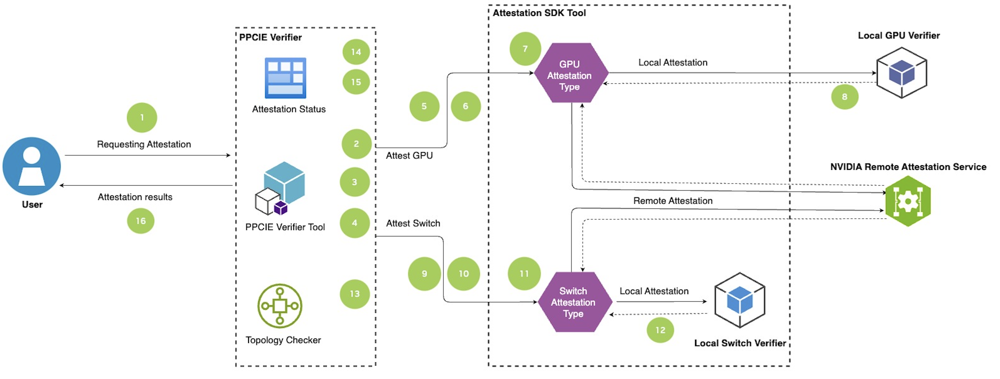

# Protected PCIE Verifier 
``````markdown
   - Overview 
   - Architecture diagram
   - Getting Started
      - Prerequisites
      - Installation
      - Usage
      - Troubleshooting
   - License
``````
## Overview 
In a multi-GPU confidential computing (CC) setup, NVLink interconnects and NVSwitches are used for GPU to GPU data traffic. NVLink interconnects and NVSwitches are outside the trust boundary and thus should not allow access to plain-text data. All data that flows over NVLink must be encrypted prior to transfer and decrypted at the destination GPU. On the GPU encryption and decryption is performed by the GPU copy engine (CE).

Bouncing through a CE adds constraints and latency to the data path which may result in performance drops for some workloads. 
To minimize performance impact, NVIDIA's 'PPCIE' mode adjusts the security model to trust NVLink data, enabling plain-text traffic without CEs while preserving a Confidential Virtual Machine.

**Note**: There are only two supported GPU usage configurations:
ALL GPUs are in CC mode. Each GPU can be assigned to one Confidential VM. In this scenario, use the CC verifier.
ALL GPUs are in PPCIe mode. All GPUs must be assigned one Confidential VM. In this scenario, use the PPCIE verifier

## High-Level Architecture Diagram


The PPCIE verifier is a tool designed to verify the security of the multi-GPU system by attesting to the integrity of its GPUs and NVSwitches. 
The attestation SDK is used to gather evidence for each device, with further attestation performed either locally or remotely, as specified by the user when running the PPCIE Verifier tool.

After collecting attestation results for each device, the PPCIE verifier validates these results against a policy file to confirm that all claims are legitimate. 
Following the attestation process, the tool conducts a final topology check to verify that the devices are securely connected to the expected configuration. The final attestation results are then presented to the user, detailing the checks performed.

### Detailed Architecture Flow


1. The PPCIE Verifier tool is initiated by the user, who specifies the attestation mode for both GPUs and NvSwitches.
2. The system components are enumerated (number of GPUs and NvSwitches).
3. Pre-checks are performed on each GPU to ensure it is configured for confidential computing.
4. Pre-checks are performed on each NvSwitch to ensure it is configured for confidential computing.
5. The required GPU evidence for attestation is collected from the Attestation SDK for each GPU.
6. Once the evidence is collected, the PPCIE Verifier tool initiates attestation verification based on the mode specified by the user.
7. GPU attestation is initiated by the Attestation SDK: the local-gpu-verifier is used for local attestation, while NRAS (NVIDIA's Remote Attestation Service) is used for remote attestation.
8. The Attestation SDK provides GPU attestation results to the PPCIE Verifier.
9. If the GPU attestation is successful, the PPCIE Verifier proceeds to collect evidence for the NvSwitches from the Attestation SDK.
10. Once all NvSwitch evidence is collected, attestation is initiated by the PPCIE Verifier.
11. NvSwitch attestation is performed by the Attestation SDK: the local-switch-verifier is used for local attestation, while NRAS is used for remote attestation.
12. The Attestation SDK provides NvSwitch attestation results to the PPCIE Verifier.
13. If the NvSwitch attestation is successful, the PPCIE Verifier performs a topology check to ensure the devices are securely connected in the expected configuration.
14. The PPCIE Verifier determines the overall results and updates the status for each check it performs.
15. The GPU ready state is set.
16. The final attestation results are presented to the user, detailing the checks performed and the status of each device in the system.

## Getting started

### Prerequisites
    HGX system with 8 GPUs and 4 switches assigned to the single tenant
    python >= 3.8
    git installed
    Nvidia GPU driver installed
    Nvidia Switch driver installed
    Nvidia Fabric Manager installed

### Installation/Dependencies


PPCIE Verifier has the following dependencies:

- nv-attestation-sdk (Attestation SDK)
- nv-local-gpu-verifier (Local GPU Verifier)
- nv-switch-verifier (Local Switch Verifier) Note: nv-switch-verifier (Local Switch Verifier) This is a module inside attestation-sdk and does not require separate installation

Installation Instructions:

Please elevate to Root User Privileges before installing the packages: (Note: This is necessary to set the GPU ready state)
         
         sudo -i
         
Method 1: Using installer script
            
        1. git clone https://github.com/NVIDIA/nvtrust/tree/main
        2. cd nvtrust/guest_tools/ppcie-verifier/install
        3. source ppcie-installer.sh  (This would install the required dependencies)

Method 2: Using PyPI (Requires python virtual environment creation)
            
        1. python3 -m venv venv
        2. source venv/bin/activate
        3. pip3 install nv-ppcie-verifier (This would automatically install nv-attestation-sdk, nv-local-gpu-verifier and nv-switch-verifier)


### Usage
    python3 -m ppcie.verifier.verification --gpu-attestation-mode=LOCAL --switch-attestation-mode=LOCAL (Example arguments provided)

#### Options
  
| Option                     | Description                           | Value Options                                                            |
|----------------------------|---------------------------------------|--------------------------------------------------------------------------|
| `--gpu-attestation-mode`   | Type of GPU Attestation               | LOCAL, REMOTE                                                          |
| `--switch-attestation-mode`| Type of nvSwitch Attestation          | LOCAL,  REMOTE                                                          |
| `--log`                    | Configure log level                   | DEBUG, INFO, WARNING, ERROR, TRACE, CRITICAL               |


## Troubleshooting
Below are some of the common issues that have been encountered:
### Installation Issues:
1. `ModuleNotFoundError: No module named 'nv_attestation_sdk'` while installing the packages using the installer script(ppcie-installer.sh)

     **Solution**: Delete the venv created and try installing the packages using the script again
2. If you encounter warning and installation issues similar to the below while installing the package:
    `WARNING: Ignoring invalid distribution ~v-attestation-sdk <site-package-directory>`
Please execute the following commands to clean up packages that were not installed properly and then re-try the installation:
     
      **Solution**: `rm -rf $(ls -l <site-packages-directory> | grep '~' | awk '{print $9}')`

### Configuration Issues
1. `The nvmlInit call timed out.` or `Error in Initializing NVML library. Please install the drivers again and re-try`

    **Solution**: This requires re-installing the Nvidia GPU driver and fabric manager 
2. `NSCQWarning: NSCQ_RC_WARNING_RDT_INIT_FAILURE`

    **Solution**: This requires installing the correct version of the Nvidia Switch driver compatible with the GPU driver

## License
The license for this repository is Apache v2 except where otherwise noted.